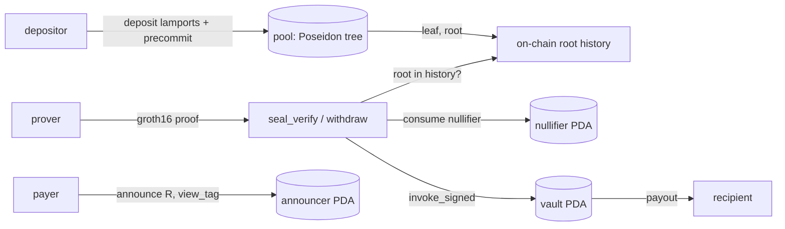

# jat-program

<p>
  <a href="https://github.com/JatProtocol/jat-program/blob/main/LICENSE">
    
  </a>
  <a href="https://github.com/JatProtocol/jat-program/actions/workflows/ci.yml">
    
  </a>
  
  
  
  <a href="https://github.com/JatProtocol/jat-program/releases">
    
  </a>
  <a href="https://github.com/JatProtocol/jat-program/commits/main">
    
  </a>
  <a href="https://www.jat.cash">
    
  </a>
  <a href="https://x.com/Jat_cash">
    
  </a>
</p>

On-chain programs for **Jat**, a proof-of-payment access primitive on Solana. This repo is the Anchor
workspace: the shielded pool with its on-chain Poseidon Merkle tree and Groth16 verifier,
and the stealth announcer. The original code lives in `programs/`; everything under
`programs/*/src` is first-party. The zero-knowledge circuits are in `jat-circuits` and the
client SDK and services are in `jat-sdk`.

## What is here

- **Pool** program: an incremental Poseidon (BN254) Merkle tree of depth twenty, a Groth16
  withdraw verifier over the `alt_bn128` syscalls, single-use nullifier accounts, and a
  trustless vault payout that signs with a program derived address. No authority sets the
  root; the root is a deterministic function of deposits.
- **Announcer** program: one write-once record per payment holding the ephemeral key `R`, a
  one-byte view tag, and the scheme, keyed by a program derived address. Holds no funds and
  has no authority.

## Features

| Capability | Program | Status |
| --- | --- | --- |
| Incremental Poseidon Merkle tree (depth 20) | pool | stable |
| Fixed-denomination deposits | pool | stable |
| Proof-of-receipt gate (`seal_verify`, CPI-able) | pool | stable |
| ZK withdraw with recipient binding | pool | beta |
| Single-use nullifier accounts | pool | stable |
| Stealth announcement index | announcer | stable |

## Architecture



A deposit pins the leaf's value to the lamports actually moved in and inserts
`leaf = Poseidon(value, label, precommit)` into the program's own tree. A withdraw proves
membership under a recent root, binds the payout to the recipient by
`Poseidon(hi16, lo16)`, consumes a global nullifier, and pays out of the vault PDA. No
operator, no upgrade-time root injection.

## Deployments

Network: **Solana devnet**.

| Program | Address |
| --- | --- |
| Pool | `seuH78RmBPVzoKToLQVEZrDvuL5jDNBSbptozWK9PEm` |
| Announcer | `seaWHA64tVzN8yfa33bE6cvqKRSxVp3R6c7Ts5NXPM9` |

Verify on an explorer with the cluster set to devnet:
`https://explorer.solana.com/address/seuH78RmBPVzoKToLQVEZrDvuL5jDNBSbptozWK9PEm?cluster=devnet`

## Build

```bash
git clone --recurse-submodules https://github.com/JatProtocol/jat-program
cd peepy
anchor build
# or, for a devnet SBPFv3 deploy:
cargo-build-sbf --arch v3
```

Host tests run without a validator:

```bash
cargo test --workspace
```

`cargo test` checks that a real circom/snarkjs proof verifies through `groth16-solana`, and
that the on-chain Poseidon insert reproduces the proof's Merkle root. If either fails, the
program and the circuits have drifted apart.

Program keypairs and wallets are gitignored and never committed.

## Instructions

| Instruction | Program | What it does |
| --- | --- | --- |
| `init_tree` | pool | Seed the empty Poseidon tree; no authority field |
| `deposit` | pool | Move lamports in, insert a commitment leaf |
| `seal_verify` | pool | Verify a proof-of-receipt, consume a scoped nullifier |
| `withdraw` | pool | Prove ownership, pay out of the vault, consume a global nullifier |
| `announce` | announcer | Write a stealth announcement PDA keyed by `R` |

## Project structure

```
peepy/
  programs/
    seal/
      src/lib.rs        init_tree, deposit, seal_verify, withdraw + Poseidon helpers
      src/vk.rs         gate verifying key (BN254)
      src/vk_withdraw.rs withdraw verifying key (BN254)
    announcer/
      src/lib.rs        announce + Announcement account
      tests/announce.rs wire-format pins against the IDL
  Anchor.toml           toolchain, program ids per cluster, scripts
  Cargo.toml            workspace, release profile
  CEREMONY.md           trusted-setup ceremony for mainnet keys
  SECURITY.md           threat model, hardening, roadmap
```

## Status

Runs on devnet. The full round-trip works end to end. No third-party audit yet, and the
pool uses a Groth16 trusted setup, so treat the current parameters as devnet-grade. Do not
use with real funds. The path to mainnet is in `CEREMONY.md` and `SECURITY.md`.

## Contributing

See [CONTRIBUTING.md](CONTRIBUTING.md) and [CODE_OF_CONDUCT.md](CODE_OF_CONDUCT.md).

## License

MIT, see [LICENSE](LICENSE).

## Links

- Circuits: https://github.com/JatProtocol/jat-circuits
- SDK and services: https://github.com/JatProtocol/jat-sdk
